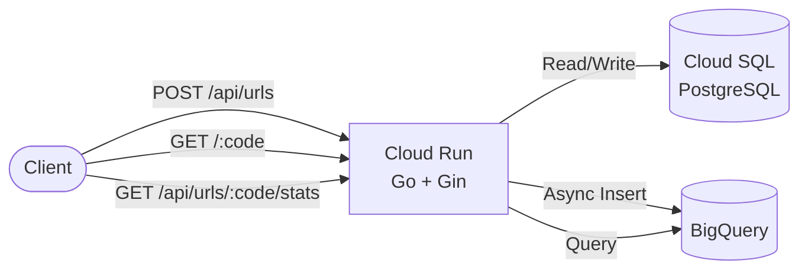

# URL Shortener API

A URL shortener with click analytics, built with Go and deployed on Google Cloud Platform.

## Architecture


### Request Flow

1. **URL Registration**: `POST /api/urls` → Generate short code → Store in Cloud SQL
2. **Redirect**: `GET /:code` → Lookup original URL → Log click to Cloud SQL + BigQuery → 302 Redirect
3. **Analytics**: `GET /api/urls/:code/stats` → Query BigQuery → Return daily click stats

## Tech Stack

| Layer | Technology |
|-------|-----------|
| Language | Go 1.24 |
| Framework | Gin |
| Database | PostgreSQL 16 (Cloud SQL) |
| Analytics | BigQuery |
| Container | Docker (multi-stage build with distroless) |
| Deployment | Cloud Run via Artifact Registry |

## API Endpoints

| Method | Path | Description |
|--------|------|-------------|
| GET | `/health` | Health check |
| POST | `/api/urls` | Register a URL |
| GET | `/api/urls/:code` | Get URL info by short code |
| GET | `/:code` | Redirect to original URL (302) |
| GET | `/api/urls/:code/stats` | Click statistics (total + daily) |
| GET | `/api/urls/:code/referers` | Referer breakdown |

### Query Parameters (stats & referers)

| Param | Format | Default | Example |
|-------|--------|---------|---------|
| `from` | `YYYY-MM-DD` | 30 days ago | `?from=2025-01-01` |
| `to` | `YYYY-MM-DD` | today | `?to=2025-12-31` |

### Example
```bash
# Register a URL
curl -X POST https://your-service.run.app/api/urls \
  -H "Content-Type: application/json" \
  -d '{"url": "https://example.com"}'

# Response
{
  "short_code": "aBc1234",
  "original_url": "https://example.com",
  "short_url": "https://your-service.run.app/aBc1234"
}

# Get click stats
curl https://your-service.run.app/api/urls/aBc1234/stats

# Response
{
  "short_code": "aBc1234",
  "total_clicks": 42,
  "daily_clicks": [
    {"date": "2025-06-01", "clicks": 15},
    {"date": "2025-06-02", "clicks": 27}
  ]
}
```

## Project Structure
```
├── cmd/api/
│   └── main.go                  # Entry point, DI, routing
├── internal/
│   ├── handler/                 # HTTP handlers (Gin)
│   │   ├── url.go               # URL CRUD
│   │   ├── redirect.go          # Redirect + click logging
│   │   └── stats.go             # Analytics endpoints
│   ├── model/                   # Data structures
│   │   ├── url.go               # URL model
│   │   ├── click_log.go         # Click log model (Cloud SQL)
│   │   ├── click_event.go       # Click event model (BigQuery)
│   │   └── stats.go             # Analytics response models
│   ├── repository/              # Data access layer
│   │   ├── url.go               # URL repository (Cloud SQL)
│   │   ├── click_log.go         # Click log repository (Cloud SQL)
│   │   ├── click_log_bq.go      # Click event repository (BigQuery)
│   │   └── stats_bq.go          # Analytics queries (BigQuery)
│   └── service/                 # Business logic
│       ├── url.go               # Short code generation
│       └── click_log.go         # Redirect + dual write
├── db/migrations/               # SQL migration files
├── Dockerfile                   # Multi-stage build
└── docker-compose.yml           # Local development
```

## Local Development
```bash
# Start PostgreSQL
docker compose up db -d

# Run the application
go run cmd/api/main.go

# With BigQuery (requires GCP credentials)
GCP_PROJECT=your-project go run cmd/api/main.go
```

## Design Decisions

- **Dual write (Cloud SQL + BigQuery)**: Cloud SQL is the source of truth for click logs. BigQuery receives an async copy for analytics, using goroutines to avoid impacting redirect latency.
- **Denormalized BigQuery schema**: `click_events` stores `short_code` and `original_url` directly instead of `url_id`, eliminating JOINs for analytical queries.
- **Time partitioning**: BigQuery table is partitioned by `clicked_at` to minimize scan costs and improve query performance.
- **Graceful degradation**: If BigQuery is unavailable, redirects and click logging to Cloud SQL continue to work normally.

## License

MIT
